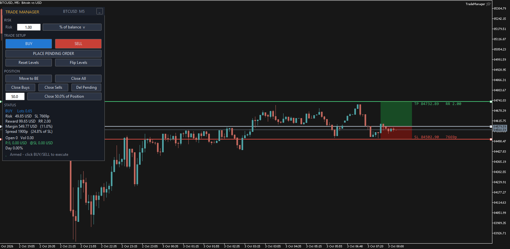
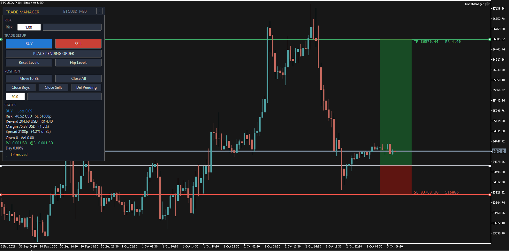

# RiskDesk-MT5

> Professional risk & trade management panel for MetaTrader 5.

RiskDesk replaces scattered order dialogs and manual lot math with one clean panel. Position size comes from your risk budget, entry, and stop-loss in real time. Levels are draggable. Pending direction flips automatically when you drag the entry across price.

---

## Features

- **Risk-based sizing** — percent of balance/equity or fixed money; live lot, R:R, margin, and spread preview.
- **Two-step execution** — click to arm, click again to fire. No accidental fills.
- **Market & pending** — arm as market, or drag the entry to convert to a pending order. Direction flips automatically on cross.
- **Draggable ENTRY / SL / TP** — visual zones, live recalculations.
- **Partial TPs** — configurable percentages at R multiples.
- **Break-even & trailing stop** — two-stage BE, three trail modes (points, ATR, candle).
- **Manual partial close** — user-editable percentage.
- **Protection** — daily loss lock, Friday cutoff, max spread, max open trades.
- **Compact UI** — collapsible panel, dark theme, fully re-themeable.

---

## Screenshots

| Panel | Trade box |
|:---:|:---:|
|  |  |

---

## Requirements

- MetaTrader 5 (build 3000+)
- Algo Trading enabled

---

## Installation

1. Copy `RiskDesk-MT5.mq5` to `<MT5_Data_Folder>/MQL5/Experts/`.
   *(Find it in MT5 via **File → Open Data Folder**.)*
2. Open MetaEditor (**F4**), open the file, press **F7** to compile.
3. Drag **RiskDesk-MT5** from the Navigator onto a chart.
4. Enable **Algo Trading** on the toolbar.

---

## Quick Start

1. Set your **Risk** value (e.g. `1.0` = 1% of balance).
2. Click **BUY** or **SELL** — the panel arms and the entry tracks price.
3. Drag **SL** and **TP** on the chart. Lot size and R:R update live.
4. Click the same button again to execute.

**For a pending order:** drag the **entry line** to your price — the panel switches to pending mode automatically. Direction flips when you cross the market.

---

## Inputs

| Group | Key Inputs |
|---|---|
| **General** | `InpMagic`, `InpManageAll`, `InpDeviation`, `InpMaxSpread`, `InpMaxOpenTrades` |
| **Risk** | `InpRiskMode`, `InpRiskBase`, `InpRiskValue` |
| **Levels** | `InpAtrPeriod`, `InpAtrMultiplier`, `InpFinalRR` |
| **Partials** | `InpPartialEnable`, `InpTp1R/Pct`, `InpTp2R/Pct` |
| **Break-Even** | `InpBeEnable`, `InpBe1TriggerR`, `InpBe2TriggerR/LockR` |
| **Trailing** | `InpTrailEnable`, `InpTrailMode`, `InpTrailStartR` + mode-specific |
| **Protection** | `InpMaxDailyLossPct`, `InpCloseOnLock`, `InpFridayCloseHour` |
| **Appearance** | `InpOffsetX/Y`, fonts, colors |

Full descriptions are in the source file comments.

---

## Controls

| Action | Result |
|---|---|
| Click **BUY** / **SELL** | Arm (or execute if already armed in that direction) |
| Drag **ENTRY** | Convert to pending; direction flips on cross |
| Drag **SL** / **TP** | Redefine risk / reward distances |
| **Reset Levels** | Clear all state |
| **Flip Levels** | Mirror SL & TP around entry |
| **Move to BE** | Move profitable positions to break-even |
| **Close N% of Position** | Partial close with editable percentage |
| **Close Buys / Sells / All** | Close by direction or all |
| **Del Pending** | Delete managed pending orders |
| **_** (title bar) | Minimize / restore |

---

## Notes

- Settings (risk mode, risk value, close %) persist per account via MT5 global variables.
- Works on netting and hedging accounts, any symbol.
- Nothing executes without two clicks — all automation is opt-in via inputs.

---

## Contributing

Issues and PRs welcome. Compile with zero warnings, test on demo, document new inputs.

---

## License

MIT — see [LICENSE](LICENSE).

---

## Contact

- **Developer:** Keiwan
- **Telegram:** [@keiwan_k99](https://t.me/keiwan_k99)
- **Issues:** [GitHub Issues](https://github.com/keiwan/RiskDesk-MT5/issues)

## Updates

Follow [@keiwan_dev](https://t.me/keiwan_dev) on Telegram for release
announcements and devlogs.
